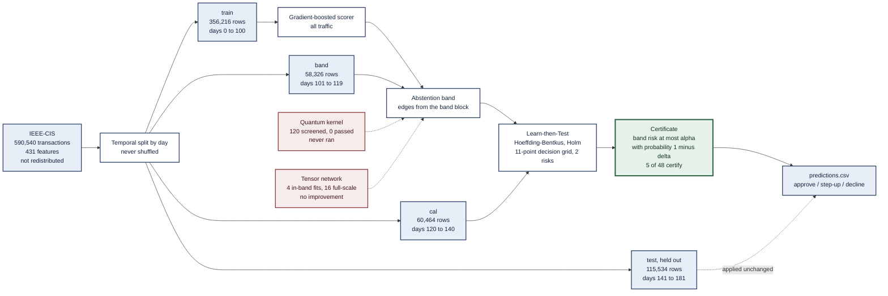
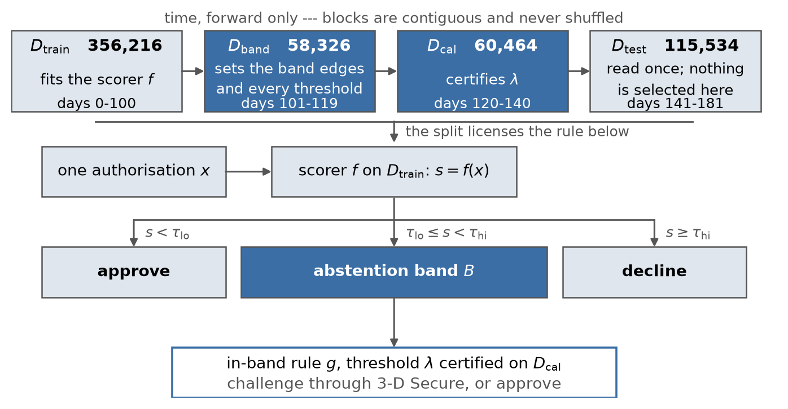

# Certified abstention for card-fraud decisions, with two quantum arms reported as measured

Phase I submission, Global Quantum + AI Challenge 2026, HSBC track — *Quantum-Enhanced Credit
Card Fraud Detection for Digital Payment Ecosystems*.

The contribution is a **distribution-free certificate on a decision an issuer actually
makes**, and an honest measurement of where two quantum approaches sit relative to a strong
classical baseline. Neither quantum arm produced a usable result, and they failed differently:
the kernel was rejected by its own a-priori screens, while the tensor network ran and yielded a
non-superiority bound from an underpowered comparison. Both are reported in the body, with the
evidence that produced them.

---

## 1. Deliverables

The five files uploaded to the portal, produced by `make submission` into
`submission/portal/` -- a local staging directory `.gitignore` excludes, so it is absent from
the public tree; every file in it is a byte-identical copy of a tracked artefact. The portal accepts PDF, PNG, JPG, WEBP, GIF, PY,
JSON, JS, XLS, XLSX, CSV, DOC and DOCX, in five slots, with a 20 MB cap; `assemble_submission.py`
refuses to stage anything outside that list.

| # | Uploaded as | Format | What it is |
|---|---|---|---|
| 1 | `HSBC-proposal.pdf` | PDF, 6 pp. | The concept proposal. Built from [`submission/content/`](submission/content) with every figure bound to a table |
| 2 | `HSBC-appendix.pdf` | PDF, 3 pp. | Pre-registration and amendments, what we got wrong, the reproduction record, and the challenge statement's primary metrics in full (ROC AUC, AUPRC, $F_1$, precision, recall, confusion matrix) |
| 3 | `HSBC-predictions.csv` | CSV, 115,534 rows | Per-transaction output on the held-out block: the fraud probability in $[0, 1]$, the three-valued decision, and the binary decline it implies, with the band edges and certified threshold on every row so the decision is recomputable from the file — [`predictions.csv`](results/tables/predictions.csv) |
| 4 | `HSBC-riskcontrol.py` | PY | The Learn-then-Test implementation the certificate rests on — [`riskcontrol.py`](src/hsbcfraud/conformal/riskcontrol.py) |
| 5 | `HSBC-certified-region.png` | PNG | Which (band budget, $\alpha$, $\alpha_{\mathrm{FN}}$) cells certify and which do not — [`certified_region.png`](results/figures/certified_region.png) |

The four Expected Outcomes listed on the portal's challenge panel — the statement's §5.2
Expected Outputs together with its Reporting Considerations — are each answered by a named
artefact:
per-transaction probabilities and binary predictions by upload 3; feature attribution by §5 of
the proposal and [`attribution_examples.csv`](results/tables/attribution_examples.csv), which
carries the Shapley contributions behind ten individual predictions; the classical-baseline
comparison by §3 against a gradient-boosted baseline at fixed hyperparameters, which is the
one classical baseline the statement requires; and the quantum encoding and circuit-design
documentation by §4 and §7.

Upload 3 replaced the certificate table, whose full 48-cell grid is exactly what upload 5
plots and which is public as [`riskcontrol.csv`](results/tables/riskcontrol.csv). It was the
only staged file a reviewer could read somewhere else.

The proposal maps to the six assessment criteria as: problem framing and expected impact (§1),
technical approach (§2, §4), feasibility and resources (§5), validation plan (§6), hybrid
design (§7), team (§8). The challenge statement's own requirements are covered as: primary
metrics (appendix §A4), comparison against a classical baseline (§3), published-leaderboard
comparison with methodology (§3), quantum encoding and circuit design (§4), quantum execution
sample count (§7), behaviour under temporal distribution shift (§3), feature attribution (§5,
from [`attribution.csv`](results/tables/attribution.csv) — see [D-048](docs/decisions.md)), and
inference latency (§5, from [`latency.csv`](results/tables/latency.csv)).

**Supporting documents**, not uploaded but referenced from the proposal and public in this
repository:

| Document | What it carries |
|---|---|
| [`docs/protocol.md`](docs/protocol.md) | The frozen pre-registration and its dated amendments |
| [`docs/guarantee.md`](docs/guarantee.md) | The guarantee stated once: notation, theorem, golden values, and seven things it does **not** cover |
| [`docs/decisions.md`](docs/decisions.md) | Every decision and every retraction, in order |
| [`docs/RESULTS.md`](docs/RESULTS.md) | Every result table in full, with the caveat attached to each and the retractions that produced them |
| [`docs/ENVIRONMENT.md`](docs/ENVIRONMENT.md) | The machine, the pinned versions, and the measured wall-clock cost of each stage |
| [`docs/COMPLIANCE_CHECKLIST.md`](docs/COMPLIANCE_CHECKLIST.md) | Every requirement in the four official documents, with where it is met |
| [`docs/REFERENCES.md`](docs/REFERENCES.md) | The reference list |
| [`docs/REFERENCE_IMPLEMENTATION.md`](docs/REFERENCE_IMPLEMENTATION.md) | Which reference each module realises, and whether the code does what the reference says |
| [`docs/REFERENCE_CROSSCHECK.md`](docs/REFERENCE_CROSSCHECK.md) | Which module or document reaches each reference — generated, not written |
| [`docs/REGULATORY_SOURCES.md`](docs/REGULATORY_SOURCES.md) | Official locators for every instrument, and what was verified at the issuing authority |
| [`docs/PROVENANCE.md`](docs/PROVENANCE.md) | Where every algorithm and dataset came from |
| [`docs/CREDENTIALS.md`](docs/CREDENTIALS.md) | Every biographical claim in the team section, what backs it, and what is unresolved |
| [`docs/FACTCHECK_LOG.md`](docs/FACTCHECK_LOG.md) | What was checked, against which source, on what date, and which claims the check overturned |
| [`docs/OPEN_FINDINGS.md`](docs/OPEN_FINDINGS.md) | Every audit finding beyond the decision log, with its status: seven closed and verified, one will-not-fix, one deferred, one unexplained, two reproduced and then withdrawn |
| [`docs/CLEANROOM.md`](docs/CLEANROOM.md) | Reproducing from an empty directory: the procedure, what it costs, and which steps were actually exercised |
| [`docs/SUBMISSION_CHECKLIST.md`](docs/SUBMISSION_CHECKLIST.md) | The pre-submission verification list |
| [`docs/VERIFICATION_CHECKLIST.md`](docs/VERIFICATION_CHECKLIST.md) | Which official documents and external artefacts were checked against the submission, and which checks remain open |

**Where every number was measured.** One workstation, no cloud: Intel Core i5-13600K (14 cores,
20 threads), NVIDIA RTX PRO 6000 Blackwell Workstation Edition 96 GB on driver 580.105.08,
125 GB memory, AlmaLinux 9.7, Python 3.12.11, PyTorch 2.13.0+cu130 on CUDA 13.0. No quantum
hardware: both quantum arms are simulator-only, which the challenge statement permits and does
not penalise.

**What each stage costs**, so a reader can judge the resource claim without running it:

| Stage | Work | Measured cost | Device |
|---|---|---|---|
| Classical baseline | 356,216 train rows, 439 features, one fit per seed | 15.9 – 18.8 s | GPU |
| Quantum kernel screens | 120 configurations, 300 rows each | 17.5 s total | CPU |
| Tensor network, in-band | 8 sites, four bond dimensions | 0.69 – 1.91 s per fit | GPU |
| Tensor network, full scale | 431 sites, 356,216 rows, 30 epochs | 2,685 – 2,783 s per fit | GPU |
| Conformal calibration | a sort and a grid scan | seconds | CPU |
| Full sweep (`make seedsweep`) | 16 fits, four bond dimensions x four seeds | 12.1 GPU-hours | GPU |

`make reproduce` excludes the sweep. Everything else completes in well under an hour.
[`docs/ENVIRONMENT.md`](docs/ENVIRONMENT.md) carries the pinned versions, the per-stage detail
and the two environment traps that cost real time.

---

## 2. The whole picture

### 2.1 The pipeline, end to end


The same figure opens section 2 of the proposal. Shaded stages carry the guarantee: the band
edges are frozen on $D_{\mathrm{band}}$, $\lambda$ is certified on $D_{\mathrm{cal}}$, and
$D_{\mathrm{test}}$ is read once with nothing selected on it. The two dashed boxes are the
quantum arms, drawn where they would have entered and dashed because neither arrived.

The Mermaid diagram below carries the same pipeline with every row count in it, and is checked
against [`splits.csv`](results/tables/splits.csv) on every test run.

Row counts and the dataset total are asserted against
[`splits.csv`](results/tables/splits.csv) by `tests/test_repo_hygiene.py`; the configuration
counts come from [`claims.yaml`](docs/claims.yaml). The day ranges and the feature count are
transcribed from `splits.csv` and `latency.csv`. All are on the temporal arm. Solid arrows
carry data. The dashed arrows into the band are the only place a quantum model
could enter, and neither arm got there; the dashed arrow into the output marks the held-out
block, which the certified rule is applied to unchanged and never selected on.



**Read the diagram this way.** The classical scorer runs on every transaction; the band is the
only region a quantum model is ever asked to touch, because it holds thousands of rows rather
than hundreds of thousands. Both quantum arms are drawn as dashed because neither was adopted:
the kernel was rejected by its own screens before it ran, and the tensor network ran in the
band and did not improve on gradient boosting. **The certificate does not depend on either**
--- it wraps whatever scores the band, which is why the deliverable survived two negative
quantum results.

Each block is used exactly once and for one purpose. `train` fits the scorer, `band` sets the
edges, `cal` certifies, and `test` is touched once at the end. That separation is what the
guarantee needs; [`TestFoldGuard`](src/hsbcfraud/data/splits.py) enforces it in code rather than
by convention.

### 2.2 The split geometry, and the rule it licenses



Read it top to bottom. The four blocks are contiguous in time and never shuffled; the two
shaded ones carry the guarantee. Band edges and every threshold come from
$D_{\mathrm{band}}$, $\lambda$ is certified on $D_{\mathrm{cal}}$, and nothing is selected on
$D_{\mathrm{test}}$. That geometry is what removes the *selective* break in exchangeability —
conditioning on band membership would be conditioning on a data-dependent event if the edges
had been estimated on the data used to certify. Only the temporal break survives, and
[§5.2](#52-coverage-fails-under-time-and-the-controls-do-not-reproduce-it) measures it.

Beneath it is the rule the split licenses: one score, three actions, and a certificate that
binds the false-decline rate **inside the band** rather than over all traffic. Counts and day
ranges are drawn from `splits.csv` on every build, so the picture cannot disagree with the
table.

---

## 3. What is claimed, and what is not

| | Claim | Status | Evidence |
|---|---|---|---|
| C1 | A three-valued decision rule (approve / step-up / decline) admits a finite-sample, distribution-free risk certificate on the **band-conditional** false-decline rate and the false-negative rate simultaneously | Supported at loose levels only: 5 of 48 configurations, none below $\alpha = 0.10$ | [`riskcontrol.csv`](results/tables/riskcontrol.csv), [protocol §6](docs/protocol.md) |
| C2 | Split-conformal coverage **fails under a temporal split** and holds under a stratified one; the card-disjoint control *over*-covers on 2 of 5 seeds at $\alpha = 0.01$ and *under*-covers on 1 of 5 at $\alpha = 0.001$ | Supported, with the direction of each deviation stated separately by level | [`coverage_seed_summary.csv`](results/tables/coverage_seed_summary.csv), [`coverage_by_arm_seeds.csv`](results/tables/coverage_by_arm_seeds.csv) |
| C3 | The size of the temporal breach is **origin-dependent**, not a fixed property of the data | Supported; this narrows C2 | [`rolling_origin.csv`](results/tables/rolling_origin.csv) |
| C4 | A fidelity quantum kernel is **rejected before being run** by two a-priori screens | Supported | [`screens.csv`](results/tables/screens.csv), [protocol §9 and amendment A6](docs/protocol.md) |
| C5 | A matrix-product-state classifier does not beat the gradient-boosted baseline in the band, whose hyperparameters are fixed rather than searched and were [checked against a twelve-configuration sweep](docs/RESULTS.md#is-the-classical-baseline-tuned-enough-to-be-a-fair-comparator) | Weaker than a null result: **underpowered** against the pre-registered ceiling: the effect this comparison could resolve is 0.0557 AP against a ceiling of 0.023. What survives is a non-superiority bound of about +0.02 AP | [`mps_h4.csv`](results/tables/mps_h4.csv), [`power.csv`](results/tables/power.csv), [D-030](docs/decisions.md) |
| C6 | At **full scale** the same classifier loses by roughly a factor of two in average precision, across 16 fits at four seeds | Supported | [`mps_seed_sweep_summary.csv`](results/tables/mps_seed_sweep_summary.csv) |
| C7 | The bond-dimension sweep is **launch-bound**, not governed by $\chi$ | Supported; this is what makes C6 affordable | [`mps_seed_sweep.csv`](results/tables/mps_seed_sweep.csv), [D-032](docs/decisions.md) |

**Not claimed.** No quantum advantage of any kind. No portfolio-level PSD2 compliance
figure (see [amendment A2](docs/protocol.md)). No claim that the certificate binds the
unconditional false-decline rate — it does not, and §1 of the protocol says why.

---

## 4. The certificate

### 4.1 Estimand

The certified quantity is conditional on the band, not marginal:

```math
R(\lambda) \;=\; \mathbb{P}\bigl(\, D(X) = \texttt{DECLINE} \;\bigm|\; Y = 0,\; X \in B\,\bigr)
```

where $B = \lbrace x : \tau_{\mathrm{lo}} \le f(x) \lt \tau_{\mathrm{hi}} \rbrace$ is the abstention band and
$D$ the composite rule. The marginal rate $\mathbb{P}(D(X)=\texttt{DECLINE} \mid Y=0)$ is
reported alongside and is deliberately **not** the headline: it is dominated by
$\tau_{\mathrm{hi}}$ and would barely move if the in-band scorer were replaced by a coin
flip. A certificate that does not bind the component it licenses is not evidence about that
component.

### 4.2 Risk control

Learn-then-Test (Angelopoulos, Bates, Candès, Jordan & Lei, *AoAS* 19(2):1641–1662, 2025)
controls the family-wise error over a **pre-specified finite grid** $\Lambda$. For each
$\lambda \in \Lambda$ the Hoeffding–Bentkus p-value is

```math
p^{\mathrm{HB}}_\lambda \;=\; \min\Bigl\{ \, \exp\bigl(-n\, h_1(\hat{R}(\lambda) \wedge \alpha,\ \alpha)\bigr),\;\; e\,\mathbb{P}\bigl(\mathrm{Bin}(n,\alpha) \le \lceil n\hat{R}(\lambda)\rceil\bigr) \,\Bigr\}
```

with $h_1(a,b) = a\log\frac{a}{b} + (1-a)\log\frac{1-a}{1-b}$. Two risks are controlled
jointly — the band-conditional false-decline rate at $\alpha$ and the false-negative rate at
$\alpha_{\mathrm{FN}}$ — with Holm across the grid.

**The bound applies only to a mean of per-observation losses.** An earlier
`recall_shortfall`, defined as $\max(0, \text{floor} - \text{recall})/\text{floor}$, is a
nonlinear transform of a mean and therefore produced quantities that were not valid
p-values. It was replaced by a genuine 0/1 loss averaged over frauds; controlling the FNR at
$\alpha_{\mathrm{FN}}$ is equivalent to a recall floor at $1 - \alpha_{\mathrm{FN}}$, so
nothing is lost. See [D-024](docs/decisions.md).

### 4.3 Coverage validation, and why the naive check is wrong

For a sound split-conformal system the number of test errors is not merely bounded in
expectation — it follows an exact predictive law:

```math
E \;\sim\; \mathrm{BetaBinomial}\bigl(m,\; n + 1 - k,\; k\bigr), \qquad k = \lceil (n+1)(1-\alpha) \rceil
```

Checking $\hat{r} \le \alpha$ instead is a **one-sided test against the wrong null**: on a
correctly calibrated system with $n = 5{,}000$, $\alpha = 0.01$ and $m = 20{,}000$ it passes
52.55 % of the time ([D-012](docs/decisions.md)); the exact figure moves with $n$, $m$ and
$\alpha$. Every coverage row in
[`coverage_by_arm.csv`](results/tables/coverage_by_arm.csv) is judged against the
Beta-Binomial interval, not against $\alpha$.

### 4.4 The reachability limit, stated up front

At the tightest band budget (2 % of traffic) $D_{\mathrm{cal}}$ contributes only 847
legitimate in-band rows; the four budgets on the grid give 847, 1572, 2259 and 4831. What
binds is the concentration bound: Hoeffding-Bentkus under Holm, over the decision grid and
both risks, needs the observed risk to sit far enough below $\alpha$ for the bound to reject,
and how far depends on that sample size. **The band-conditional certificate is sample-starved
by construction**, and the reachable $\alpha$ is capped by the band budget rather than by the
method. This is [amendment A1](docs/protocol.md), recorded before the arm ran.

An earlier version of this paragraph attributed the cap to the class-conditional degeneracy
floor of Ding, Angelopoulos, Bates, Jordan & Tibshirani (NeurIPS 2023), and printed it as
$\lceil 1/\alpha \rceil - 1$ rather than the exact $(1/\alpha) - 1$ that paper establishes.
Both were wrong. On this grid the floor is 19 rows at $\alpha = 0.05$ and 3 at $\alpha = 0.25$,
against 847 available, so it cannot bind anywhere here ([D-044](docs/decisions.md)).

---

## 5. Results

The three figures below are the argument and the sentence under each is the conclusion it
supports. Every table, every range across seeds and every retraction:
**[`docs/RESULTS.md`](docs/RESULTS.md)**. The split and the decision it licenses are in
[§2](#2-the-whole-picture).

### 5.1 What a random split buys you

A stratified random split reports **+0.3164 average precision** over a forward holdout on
identical data with an identical model — 62 % more, with non-overlapping ranges across five
seeds. That is the largest effect in this study, larger than anything either quantum arm could
have contributed, and it required no quantum method to find: only the discipline of running the
control. It is why every number below comes from a temporal split.
[Full table](docs/RESULTS.md#what-a-random-split-buys-you)

### 5.2 Coverage fails under time, and the controls do not reproduce it


Grey bands are the exact Beta-Binomial interval; red points fall outside it. **The temporal arm
breaches on every seed at the two loosest levels and on four of five at the third; the
stratified arm breaches on none, at any level.** The card-disjoint control is not clean in
either direction, and the temporal arm does *not* breach at the tightest level, where the
interval is too wide to have power. Both qualifications matter and both are stated in full.
[All twelve rows, with each deviation's direction](docs/RESULTS.md#coverage-by-split-arm)

### 5.3 What the certificate reaches, and that it holds out of sample


Filled cells certify; open cells have no admissible threshold, and the sparsity is the point.
**Five of 48 configurations certify, all strictly inside the band, and all five hold on
$D_{\mathrm{test}}$ applied unchanged.** Nothing certifies below $\alpha = 0.10$ and nothing at
the 2 % band budget; the binding mechanism is sample size acting through the concentration
bound, which [amendment A1](docs/protocol.md) predicted before the arm ran. The breach size is
also origin-dependent — two of five rolling origins breach and the earliest reverses sign — so
no fixed inflation factor is claimed.
[Certified set, held-out read and rolling origins](docs/RESULTS.md#the-certificate-holds-on-held-out-data)

### 5.4 Quantum kernel: rejected by the screens, before it ran

Two a-priori gates over 120 configurations of encoding × qubits × bandwidth × entanglement:
a kernel is usable only if it is not exponentially concentrated **and** not reproducible by a
tuned RBF ($\rho_{\mathrm{RBF}} \le 0.60$). **28 of 120 pass conditioning; none passes both.**
The closest any configuration came was $\rho_{\mathrm{RBF}} = 0.6291$. The arm was therefore
never run on the decision task — which is what pre-registering a screen is for.
[Screen definitions and the full 120](docs/RESULTS.md#quantum-kernel-rejected-by-the-screens-before-it-ran)


The statement asks for the encoding strategy and circuit design choices, and for qubit count and
circuit depth as feasibility metrics. Above are the three feature maps at their smallest
screened width, and the cost of the whole grid after transpilation to a portable
`rz, sx, x, cx` basis: **20 configurations, 1–8 qubits, at most depth 35 and 28 two-qubit
gates**. Every one is within near-term reach, which is the point — **the arm was rejected by its
own screens, not by circuit size.** The two unentangled series coincide exactly because, with
its entangling layer removed, `zz` *is* `z`; that is what makes it the control.
[`circuits.csv`](results/tables/circuits.csv) carries all 20 rows.

### 5.5 Tensor network: it ran, and it lost


Every interval contains zero, so the reading is not "the MPS is worse" but that the comparison
cannot separate them — and it is **underpowered against its own pre-registered ceiling**, which
the power gate should have said in advance and did not. What survives is a non-superiority bound
of about **+0.02 AP**, not evidence of equivalence. At full scale, sixteen fits over four bond
dimensions and four seeds lose by a factor of two or more, seed noise is 2.8 times the capacity
signal, and **two of sixteen diverged to the prior** --- they learned first, reaching their
best loss by epoch 2 of 30, and climbed back to $\ln 2$ from there ([D-121](docs/decisions.md)).
[Both tables, the power defect, and the launch-bound cost model](docs/RESULTS.md#tensor-network-it-ran-and-it-lost)

---
## 6. Negative results, and why they are in the body

Findings in this repository that contradict what the work set out to show, and one that
contradicts a claim an earlier draft had already written down:

* The **quantum kernel** was eliminated by a screen the protocol fixed in advance.
* The **tensor network** ran and did not beat gradient boosting — though the comparison
  turned out to be underpowered, so the result is a non-superiority bound rather than a
  clean null ([D-030](docs/decisions.md)).
* The **power gate meant to catch that in advance was itself mis-calibrated**, and passed a
  comparison it should have flagged. It was estimating seed noise where family noise was
  needed, and understated the standard error eightfold.
* The **temporal coverage breach** turned out to be origin-dependent, which removed a clean
  headline number ([D-019](docs/decisions.md), [D-020](docs/decisions.md),
  [D-025](docs/decisions.md) — the central result was narrowed twice).
* A **certificate that appeared to succeed was vacuous**: all 32 certified configurations
  sat at $\lambda = \tau_{\mathrm{hi}}$, where the flagged set is empty by construction, and
  it rested on an invalid p-value besides ([D-024](docs/decisions.md)).
* The **first latency measurement measured the library's threading default**, not the model —
  an OpenMP barrier over one row cost 19 ms against 0.05 ms of prediction, which flattened
  device, feature count and batch size alike. Reported as-is it would have put a tree ensemble
  at 11–31 % of the issuer's latency budget ([D-063](docs/decisions.md)).

[`docs/decisions.md`](docs/decisions.md) carries every entry including the retractions —
a memory-bandwidth witness retracted twice, a clustered-bootstrap width claim asserted from
theory and withdrawn when measured (0.89×, the opposite direction), and a `.gitignore`
pattern that silently excluded four source files from three pushed commits.

---

## 7. Reproduction

```
make venv         # python3.12, torch cu130 first (the PyPI build has no sm_120)
make smoke        # S0-S8 environment assertions; any failure stops the build
make reproduce    # every measurement target in order, then the SHA-256 manifest
make check        # rebuild PDFs, then the claim, citation and manifest gates
make walkthrough  # trace the certificate against the committed tables (seconds, no GPU)
```

**Two levels of check, and they answer different questions.** `make walkthrough` runs
[`notebooks/walkthrough.py`](notebooks/walkthrough.py), which recomputes the certificate chain
— blocks, certified configurations, held-out validation, the coverage arms, both quantum arms —
from `results/tables/` and asserts each step. It refits nothing, so it costs about a second and
answers *is what is reported internally consistent?* `make reproduce` refits everything and
answers *do the tables regenerate?* The full-scale tensor-network sweep is deliberately excluded
from `reproduce` at 12.1 GPU-hours; run it with `make seedsweep`.

The procedure for reproducing from an empty directory, and what it was measured to cost, is in
[`docs/CLEANROOM.md`](docs/CLEANROOM.md).

The pre-registration is enforced in code. [`scripts/check_protocol.py`](scripts/check_protocol.py)
hashes the **guarantee-bearing parameters** — every $\alpha$ grid, $\delta$, $\rho$, the
decision-grid size, the FWER method, the band budget and recall-floor grids, the split
fractions and the decline budget — and exits 1 on an undocumented change to any of them; exit
2 means changed *with* an amendment. It does not hash the protocol's prose, so a corrected
figure does not require an amendment. [`configs/default.yaml`](configs/default.yaml) is a
readable record generated from the committed defaults, and `--verify-dump` fails if it drifts.

The test-fold loader keeps a persisted ledger in
[`results/tables/test_access.json`](results/tables/test_access.json) — the authorised
configuration hash and how many times it has been requested — and raises on a second distinct
configuration. The single-evaluation rule is a mechanism, not a promise.

`scripts/run_mps.py` refuses to run the H4 comparison until `power.csv` exists, because a
power gate that can be computed afterwards is not a gate.

---

## 8. Repository map

### 8.1 Documents

| Path | Contents |
|---|---|
| [`docs/protocol.md`](docs/protocol.md) | Pre-registration, frozen before any model was fitted. Estimand, split, decision rule, band freezing, null hypotheses H1–H5, screens, out-of-scope claims, and its dated amendments |
| [`docs/decisions.md`](docs/decisions.md) | Every entry, including the retractions and the reason for each |
| [`docs/RESULTS.md`](docs/RESULTS.md) | Every result table in full, with the caveat attached to each and the retractions that produced them |
| [`docs/REFERENCES.md`](docs/REFERENCES.md) | 62 numbered entries, every one of them reached from somewhere in this repository: conformal theory, fraud prior art, quantum ML evidence, datasets, regulation and software, plus an unnumbered section recording sources deliberately **not** relied upon. Ten entries cited by nothing were removed rather than left for a reader to chase. [`REFERENCE_CROSSCHECK.md`](docs/REFERENCE_CROSSCHECK.md) reports which are reached from the repository and which are not |
| [`NOTICE`](NOTICE) | Third-party licences, including why `cuquantum-cu11` is not installed by default |

### 8.2 Implementation

| Path | Role |
|---|---|
| [`src/hsbcfraud/conformal/riskcontrol.py`](src/hsbcfraud/conformal/riskcontrol.py) | Learn-then-Test, Hoeffding–Bentkus p-values, Holm, the half-open in-band grid |
| [`src/hsbcfraud/data/splits.py`](src/hsbcfraud/data/splits.py) | Four-block day-snapped split, three arms, `TestFoldGuard` |
| [`src/hsbcfraud/stats.py`](src/hsbcfraud/stats.py) | Card-clustered bootstrap, exact McNemar, TOST, the two MDE forms |
| [`src/hsbcfraud/quantum/screens.py`](src/hsbcfraud/quantum/screens.py) | Effective rank, RBF correlation, Huang geometric difference |
| [`src/hsbcfraud/quantum/kernel.py`](src/hsbcfraud/quantum/kernel.py) | Fidelity kernel across four backends, measured against an exact statevector reference |
| [`src/hsbcfraud/quantum/mps.py`](src/hsbcfraud/quantum/mps.py) | MPS classifier, depth-scaled learning rate, two documented silent-bug fixes |

### 8.3 Result tables

Every number quoted in prose resolves to a file in
[`results/tables/`](results/tables/), hashed in the manifest and checked by
`scripts/check_claims.py`. `tests/test_repo_hygiene.py` asserts that each one is tracked by
git, because a table present locally but untracked makes its claim unverifiable by a
reviewer.

---

## 9. Licence and data

Code is Apache-2.0 ([`LICENSE`](LICENSE)). Raw data is never committed: IEEE-CIS is
distributed under Kaggle competition rules rather than an open licence, and the ULB dataset
is two-layer — the **database** under the Open Database License (ODbL) and its **contents**
under the Database Contents License (DbCL) v1.0. Describing it as ODbL alone, as the challenge
statement does, is incomplete; [`NOTICE`](NOTICE) records both layers. Neither dataset is
redistributed here, and both are downloaded from Kaggle by the reader.
