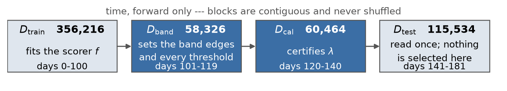
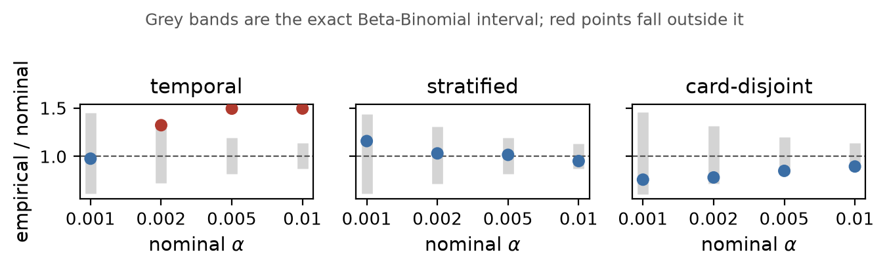
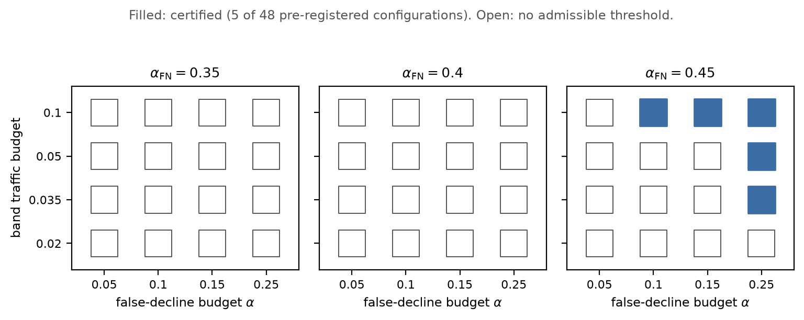
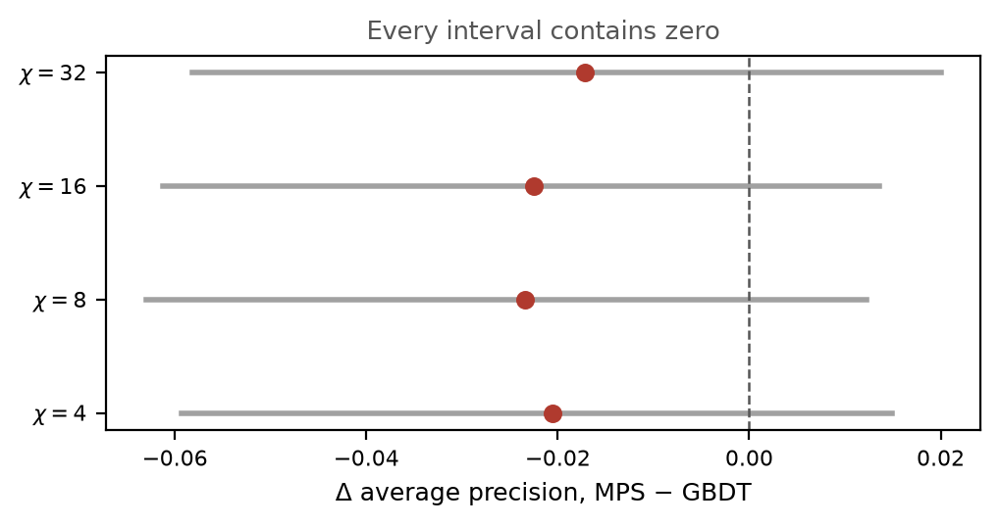

# Results in full

Every result table behind the submission, with the caveat attached to each one. The README
carries the three figures and the conclusion each supports; this file carries the numbers,
the ranges across seeds, and the retractions.

Each table is drawn from `results/tables/*.csv`. Every figure `claims.yaml` binds is recomputed
by `make claims`, and `make figures` redraws every plot from the same CSVs; the remaining
per-seed and per-chi cells are transcribed from the CSV named beside each and are not gated.

---

## What a random split buys you

Before any conformal machinery. One gradient-boosted model, fixed hyperparameters, five
seeds, three splits of the same file:

| Split | ROC AUC | AP | AP vs forward holdout |
|---|---|---|---|
| stratified random | 0.9658 | 0.8254 | **+0.3164** |
| temporal (forward holdout) | 0.8851 | 0.5090 | — |
| card-disjoint | 0.8509 | 0.5394 | +0.0304 |

Ranges do not overlap across seeds (stratified AP 0.8171–0.8356 against temporal
0.5055–0.5114). **A random split reports 62 % more average precision than a forward holdout
on identical data and an identical model.**

That is the largest effect in this study. It is larger than anything either quantum arm could
have contributed, and observing it required no quantum method — only the discipline of
running the control. It is also why every number below comes from a temporal split, though a
random one would flatter all of them.

## The split, and which block may touch which parameter



Shaded blocks carry the guarantee. Band edges and every threshold come from
$D_{\mathrm{band}}$; $\lambda$ is certified on $D_{\mathrm{cal}}$; nothing is selected on
$D_{\mathrm{test}}$. This geometry is what removes the *selective* break in exchangeability —
conditioning on band membership would be conditioning on a data-dependent event if the edges
had been estimated on the data used to certify. Only the temporal break survives, and the next
section measures it.

## Coverage by split arm

Nominal versus empirical false-decline rate on $D_{\mathrm{test}}$, calibrated on
$D_{\mathrm{cal}}$. `inside` in `coverage_by_arm_seeds.csv` is the per-seed Beta-Binomial verdict;
`finite_sample_ok` is its single-seed equivalent in `coverage_by_arm.csv`.



Grey bands are the exact interval; red points fall outside it. The interval widens sharply as
$\alpha$ tightens, which is why the temporal arm's apparent compliance at the tightest level is
weak evidence rather than a pass.

| Arm | $\alpha$ | Ratio (mean) | sd | Range | Seeds outside the interval |
|---|---|---|---|---|---|
| temporal | 0.010 | 1.436 | 0.055 | [1.349, 1.494] | **5 of 5** |
| temporal | 0.005 | 1.456 | 0.036 | [1.421, 1.493] | **5 of 5** |
| temporal | 0.002 | 1.314 | 0.067 | [1.205, 1.385] | **4 of 5** |
| temporal | 0.001 | 0.943 | 0.020 | [0.923, 0.977] | **0 of 5** |
| stratified | 0.010 | 1.008 | 0.038 | [0.952, 1.056] | **0 of 5** |
| stratified | 0.005 | 1.039 | 0.037 | [0.990, 1.084] | **0 of 5** |
| stratified | 0.002 | 1.019 | 0.071 | [0.943, 1.127] | **0 of 5** |
| stratified | 0.001 | 0.962 | 0.140 | [0.798, 1.158] | **0 of 5** |
| card-disjoint | 0.010 | 0.916 | 0.133 | [0.785, 1.076] | **2 of 5** |
| card-disjoint | 0.005 | 0.917 | 0.055 | [0.851, 0.993] | **0 of 5** |
| card-disjoint | 0.002 | 0.904 | 0.157 | [0.783, 1.166] | **0 of 5** |
| card-disjoint | 0.001 | 0.882 | 0.362 | [0.650, 1.525] | **1 of 5** |

Five seeds per arm and level, each judged against the exact Beta-Binomial interval rather than
against $\alpha$.

**The temporal arm breaches on every seed** at the two loosest levels and on four of five at
the third. **The stratified arm breaches on none, at any level.** That contrast is the result
the three-arm design was built to produce.

The card-disjoint arm is not clean, and the earlier version of this section was wrong to say
it was: it is outside on two of five seeds at $\alpha = 0.01$ and one of five at
$\alpha = 0.001$, where its spread (sd 0.362) is an order of magnitude wider than the
temporal arm's. The per-level breakdown is below, stated once rather than twice.

Two further cautions. The temporal arm does **not** breach at the tightest level: at
$\alpha = 0.001$ its mean ratio is 0.943 with every seed inside, and the Beta-Binomial band
there is wide enough to have little power. And "the breach is temporal" is stronger than three
non-randomised arms can carry — the arms differ in more than time, and by a two-sample
classifier the card-disjoint arm is the *most* distinguishable of the three (0.6554 against
the temporal arm's 0.5525). What the data supports is that the breach appears only in the arm
ordered by time, on every seed, and that neither control reproduces it.

The card-disjoint arm, level by level. At alpha = 0.001 the single outside seed runs at ratio
1.5245 against four below one, the lowest 0.6502 -- one against four reads as noise, but it is
under-coverage, so the arm is not a pass. At alpha = 0.01 both outside seeds over-cover, which
is a two-sided fit failure rather than a one-sided breach. The proposal states the verdict; the
per-level ratios are here.

How much calibration each certified configuration had. The tightest band budget leaves 847
legitimate in-band rows in the calibration block and certifies nothing at any level; the
configurations that do certify had 1572 or more. So the 847 figure describes the budget where
the certificate fails, not the sample size any certificate works with -- a distinction the
proposal's sample-starved sentence used to blur.

The censoring control in full. The trailing-window fraud rate is 3.666 % against 3.281 %
earlier -- higher, not lower, which is the opposite of what unresolved chargebacks would
produce. The Mann-Kendall trend statistic over the per-bucket rates is -0.2857 at p = 0.1994.

**That is not evidence of no trend, and the sign is worth noting.** The statistic is *negative*,
which is the direction unresolved chargebacks would produce, and p = 0.1994 over **eight**
buckets is far from significant either way -- an eight-point test has very little power against
a mild trend.

*The p-value was 0.3988 until 2026-09-06, and the change is a correction rather than a new
measurement.* `stats.kendalltau` returns a **two-sided** p by default, and the decision rule it
feeds is one-sided -- it fires only on `tau < 0` -- so the trend arm was being tested at
alpha/2 while the Fisher arm beside it was explicitly one-sided at alpha. The one-sided p is
0.1994 on the same data. The verdict does not move: it was "not detected" and remains so, and
the Fisher arm returns 1.000 either way, which is what actually carries the conjunction
([D-152](decisions.md)).

**The window the trend is measured over is 111 days, not the 120 requested.** Buckets are
selected by start day, so a 120-day request over 14-day buckets lands mid-bucket and realises
the largest whole number of buckets inside it. `label_verdict.csv` now records both figures.
Selecting overlapping buckets instead would give 125 days and a one-sided p of 0.060, and would
still not change the verdict -- but it would move partly-censored buckets into the *reference*
group, which biases the comparison towards finding nothing, so the shorter window is kept. So the two statistics point in opposite directions: the rate comparison is the
one that carries weight, and the trend statistic neither supports censoring nor rules it out.
`label_audit.py`'s own verdict string is "not detected", not "absent", and the proposal now uses
that word too.

The proposal states the two rates; the trend statistics are here, which is why this file rather
than the six-page body carries them.

## Is the classical baseline tuned enough to be a fair comparator?

The challenge statement's secondary objective 4.2 asks for improvement over "**tuned** classical
baselines". This study's XGBoost settings are seven values taken from the IEEE-CIS public
solutions, not the output of a search -- so the question is whether that leaves the comparator
weaker than it should be. Measured rather than argued.

`scripts/tune_baseline.py` ranks twelve configurations, a coordinate sweep around the shipped one
across five axes. **It searches entirely inside `D_train`**: fitted on the first 288,289 rows,
ranked on the 67,927 that follow. `D_band`, `D_cal` and `D_test` are never read, because selecting
on any of them would spend the block that sets the band edges, certifies lambda, or carries the
single-evaluation rule.

**It fits the pipeline the scorer actually ships with**, which it did not at first: the search
used the 400 raw numeric columns the loader returns, while `run_baselines.py` fits 439 features
through `encode_strings` then `add_entity_aggregates(causal=True)` then `select_model_columns`.
The row labelled "shipped" was therefore not the shipped model, and `max_depth` and
`min_child_weight` optima both move with feature count -- the search was reading the right
question off the wrong curve. Every figure below is from the corrected run
([D-147](decisions.md)).

Ranked on both metrics the statement names first -- ROC AUC, which it lists first, and AUPRC,
which it recommends for imbalanced data:

| | AUPRC | ROC AUC |
|---|---|---|
| Best of twelve | 0.5529 | 0.8987 |
| **Shipped configuration** | **0.5440** (rank 7) | **0.8885** (rank 11) |
| Worst of twelve | 0.5346 | 0.8814 |
| **Headroom above shipped** | **0.0089** | **0.0101** |
| **Spread across all twelve** | **0.0183** | **0.0172** |

**Both metrics pick the same winner**: the shipped configuration with the learning rate lowered
from 0.05 to 0.03, every other axis unchanged.

*An earlier version of this section argued the opposite* -- that AUPRC and ROC AUC disagreed about
the winner, and that the disagreement was itself evidence the ordering was noise. That argument
was an artefact of the wrong feature matrix and does not survive the corrected run. It is
withdrawn rather than quietly replaced, because it was load-bearing: it was the second of two
independent reasons given for not adopting the winner, and only the first still stands.

F1, precision and recall are deliberately not ranked on. Each needs a threshold, and choosing one
here would make the comparison depend on that choice rather than on the hyperparameters; the
certificate selects the operating point downstream, on blocks this search never reads. All five
metrics the statement names *are* reported on the held-out test set, with the confusion matrix,
in [`baselines.csv`](../results/tables/baselines.csv) and in appendix A4.

The shipped configuration ranks seventh and eleventh of twelve, which sounds worse than it is.
What matters is the scale of the whole tunable range against the effect being measured:

| Quantity | Average precision |
|---|---|
| Best-minus-shipped, the entire tuning headroom | 0.0089 |
| Spread across all twelve configurations | 0.0183 |
| **Seed noise in the quantum arm at one bond dimension** | **0.1781** |
| **The quantum arm's deficit at full scale** | **0.2602** |

**The quantum deficit is 29 times the tuning headroom and 14 times the entire tuning spread.** The
quantum arm's own run-to-run variance, at a single fixed bond dimension, is 20 times the headroom.
No hyperparameter choice available here moves the comparison's conclusion, and the classical arm
is therefore not under-tuned in any sense that bears on it.

**The winner was not adopted, and the reason is a protocol constraint rather than a judgement about materiality.** Refitting the scorer would change the band edges, lambda and the certificate, and therefore every held-out number in this study -- which requires a **second evaluation of `D_test`**. The pre-registration permits one, `TestFoldGuard` enforces it, and it has been spent. A 0.0089 AP improvement cannot be bought with the guarantee that is the deliverable. Doing so would refit the scorer, and with it the
band edges, lambda, the certificate, `predictions.csv` and ten bound claims -- and it would
require a second evaluation of the held-out fold, which the pre-registration permits once. That
is a new campaign, roughly thirteen GPU-hours and the loss of the single-evaluation record, to
move a number by one forty-sixth of the effect under study. See [D-142](decisions.md).

## The certificate holds on held-out data

All five certified configurations, applied unchanged to $D_{\mathrm{test}}$:

| Band budget | $\alpha$ | $n$ legit in band | Declined | Realised | Fraction of budget |
|---|---|---|---|---|---|
| 0.035 | 0.25 | 3,314 | 580 | 0.1750 | 0.70 |
| 0.050 | 0.25 | 4,835 | 830 | 0.1717 | 0.69 |
| 0.100 | 0.10 | 10,021 | 858 | 0.0856 | **0.86** |
| 0.100 | 0.15 | 10,021 | 858 | 0.0856 | 0.57 |
| 0.100 | 0.25 | 10,021 | 1,762 | 0.1758 | 0.70 |

**Five of five hold.** This is H5, and it had never been run — the study's headline deliverable
had no held-out evidence behind it until now.

Read it for what it is. That the machinery transfers to unseen data is a real check. That it
transfers while holding a ceiling of 0.10 to 0.25 is a weak one, because those ceilings are
loose, which [amendment A1](protocol.md) predicted from the band's sample size before the
arm ran. The pre-registered test was also specified for the wrong mechanism — Beta-Binomial
suits split conformal, not Learn-then-Test — so both it and the correct binomial tail are
reported ([amendment A5](protocol.md)).

## What the certificate actually reaches



Filled cells certify; open cells have no admissible threshold. The sparsity is the point —
a reader told "the certificate holds" would otherwise assume it holds everywhere.

Five of 48 configurations certify. All five sit **strictly inside** the band — the smallest
margin below $\tau_{\mathrm{hi}}$ is 0.0136 — which is the property an earlier version failed:
every one of its 32 "certified" configurations sat exactly at the boundary, where the flagged
set is empty by construction and the risk is structurally zero ([D-024](decisions.md)).

| Band budget | $\alpha$ | $\alpha_{\mathrm{FN}}$ | $n_{\text{legit,band}}$ | Admissible $\lambda$ | Selected |
|---|---|---|---|---|---|
| 0.035 | 0.25 | 0.45 | 1572 | 1 | 0.0582 |
| 0.050 | 0.25 | 0.45 | 2259 | 2 | 0.0541 |
| 0.100 | 0.10 | 0.45 | 4831 | 1 | 0.0537 |
| 0.100 | 0.15 | 0.45 | 4831 | 1 | 0.0537 |
| 0.100 | 0.25 | 0.45 | 4831 | 2 | 0.0426 |

These are **loose levels**, and saying so is the point.
Nothing certifies below $\alpha = 0.10$, nothing certifies at the 2 % band budget at all,
and every surviving configuration
needs $\alpha_{\mathrm{FN}} = 0.45$. The mechanism is sample size, not method: certification
appears only once the band budget is widened enough to put a few thousand legitimate rows in
$D_{\mathrm{cal}}$. That is [amendment A1](protocol.md) showing up in the measurement
exactly where it was predicted to.

## The breach is origin-dependent

Re-running the same procedure at five rolling calibration origins:

| `cal_start` (day) | Ratio | Verdict |
|---|---|---|
| 101 | 0.684 | conservative |
| 111 | 0.893 | inside |
| 121 | 1.411 | **breached** |
| 131 | 1.198 | **breached** |
| 141 | 1.126 | inside |

Two of five breach and the earliest **reverses** the sign. So the honest statement is not
"temporal splits inflate the rate by 1.4×" — it is that the deviation depends on where the
calibration window is placed, and a single origin cannot establish its magnitude. This
narrowing is recorded in [D-025](decisions.md); an earlier draft quoted 1.49× from a
single seed's maximum, which was an overclaim.

## Quantum kernel: rejected by the screens, before it ran

Two a-priori gates over 120 configurations (encoding × qubits × bandwidth × entanglement):

```math
r_{\mathrm{eff}} = \frac{1}{n}\exp\left(-\sum_i p_i \log p_i\right), \quad p_i = \frac{\sigma_i}{\sum_j \sigma_j}, \qquad \rho_{\mathrm{RBF}} = \max_{\gamma}\left|\mathrm{corr}\bigl(K_Q, K_{\mathrm{RBF}}(\gamma)\bigr)\right|
```

$r_{\mathrm{eff}}$ is the exponential of the spectral entropy of the Gram matrix, normalised by
its size, so it is 1 for a flat spectrum and near 0 for a rank-one one. $\rho_{\mathrm{RBF}}$ is
maximised over a 25-point bandwidth grid and computed on **off-diagonal entries only**: both
kernels have unit diagonal by construction, so including it would add a block of perfectly
correlated values. The absolute value matters too, since an anti-correlated kernel is no more
distinct from the RBF family than a correlated one.

A kernel is usable only if it is **not** exponentially concentrated — effective rank
$r_{\mathrm{eff}}$ inside a usable band — **and not** reproducible by a tuned RBF
($\rho_{\mathrm{RBF}} \le 0.60$). Result: **28 of 120 pass conditioning, 0 pass distinctness, 0 pass both.** The
closest any configuration came was $\rho_{\mathrm{RBF}} = 0.6291$ against a 0.60 threshold.

The kernel arm was therefore not run on the decision task. Reporting a screen that rejects
its own headline method is the point of pre-registering it.

## Tensor network: it ran, and it lost

The matrix-product-state classifier (Stoudenmire & Schwab, NeurIPS 29:4799, 2016) contracts

```math
f_\ell(\mathbf{x}) \;=\; \sum_{\{ s \}} A^{s_1}_{\alpha_1} A^{s_2}_{\alpha_1\alpha_2} \cdots A^{s_N}_{\alpha_{N-1}} W_{\alpha_{N-1}\ell} \prod_{j=1}^{N} \phi^{s_j}(x_j), \qquad \phi(x) = \bigl[\cos\tfrac{\pi x}{2},\ \sin\tfrac{\pi x}{2}\bigr]
```

The head $W$ is what makes this a classifier rather than a scalar: the cores contract to a
vector on the final bond and $W$ closes it into the two class logits $\ell$. Written without it,
every bond index is contracted and the expression has no free index at all.

with bond dimension $\chi$ swept rather than tuned.



Every interval contains zero. In-band, on identical rows and features,
against the gradient-boosted baseline — see [`mps_band.csv`](../results/tables/mps_band.csv) and
[`mps_h4.csv`](../results/tables/mps_h4.csv).

| $\chi$ | AP (MPS) | AP (GBDT) | $\Delta\mathrm{AP}$ | 95 % clustered CI | $p$ | Holm |
|---|---|---|---|---|---|---|
| 4 | 0.1202 | 0.1407 | -0.0205 | [-0.0593, +0.0149] | 0.864 | not rejected |
| 8 | 0.1173 | 0.1407 | -0.0234 | [-0.0630, +0.0122] | 0.895 | not rejected |
| 16 | 0.1183 | 0.1407 | -0.0225 | [-0.0613, +0.0136] | 0.884 | not rejected |
| 32 | 0.1235 | 0.1407 | -0.0172 | [-0.0582, +0.0200] | 0.806 | not rejected |

Every interval contains zero, so the correct reading is **not** "the MPS is worse" — it is
that the comparison cannot separate them. Note also that AP does **not** increase with $\chi$:
the ordering here is 0.1202, 0.1173, 0.1183, 0.1235, and the full-scale section below shows why no
ordering should be read from a single seed per configuration.

**And the power gate that was supposed to tell us this in advance was itself wrong.**
`power.csv` initially recorded an MDE of 0.0069 against the 0.023 ceiling, estimated from the
seed-to-seed spread of the baseline against itself. But the comparison H4 makes is between
*model families*, whose measured standard error turned out to be 0.018–0.020 — about
eightfold larger. The effect this comparison could actually resolve is 0.0557 AP, which
**exceeds** the pre-registered ceiling of 0.023 — as does the 0.0461 the corrected
pre-registration estimated. The body reports the measured figure rather than the estimate
([D-043](decisions.md)).
H4 is therefore reported as **underpowered**, exactly as the protocol commits to doing when
this happens. The gate now computes a cross-family proxy (logistic against GBDT, still no
quantum model) and binds on the larger of the two. See [D-030](decisions.md).

What survives is narrower than a null result and is stated as such: **any improvement from
the tensor network is bounded above by roughly +0.02 AP** at 95 % confidence. That is a
non-superiority bound. It is not evidence of equivalence, and it is not evidence that the
tensor network is worse.

## At full scale: sixteen fits, no readable capacity signal, two failures

### Is the full-scale comparison like for like?

**The two arms do not see the same columns, and that had not been said anywhere.** `run_mps.py`
selects raw numeric columns and gets **431**; `run_baselines.py` runs `encode_strings`, then
`add_entity_aggregates(causal=True)`, then `select_model_columns`, and gets **439**. The 439 are
a strict superset: the extra eight are entity aggregates, four keyed on `card1` and four on
`addr1` --

    card1_count_past  card1_amt_mean_past  card1_amt_std_past  card1_amt_ratio
    addr1_count_past  addr1_amt_mean_past  addr1_amt_std_past  addr1_amt_ratio

-- and card-level history is usually among the strongest signal in card-fraud data. So the
classical arm carried an advantage the quantum arm did not, in the direction of this study's own
conclusion.

**Measured rather than argued.** The baseline was refitted on exactly the 431 columns the tensor
network sees, everything else identical -- same rows, same seed, same
`run_baselines.XGBOOST_PARAMS`, scored on the same held-out block:

| Gradient-boosted baseline | Features | AP | ROC AUC |
|---|---|---|---|
| As it ships | 439 | 0.5114 | 0.8837 |
| On the tensor network's columns | 431 | **0.5083** | 0.8805 |
| **Difference** | 8 aggregates | **0.0031** | 0.0032 |

The eight aggregates are worth **0.0031 AP**. The tensor network's best full-scale draw is
0.2512 against a baseline near 0.51, a deficit of about **0.26** -- so the feature asymmetry
accounts for roughly **one part in eighty** of the gap it would have to close. The comparison is
not perfectly like for like, and correcting it moves the conclusion by nothing that can be seen
at the precision the conclusion is stated to.

*Reproduce it with the snippet in [D-155](decisions.md); it is a single fit and takes about
fifteen seconds. It is deliberately **not** a committed table: it would be an eleventh script
reading the held-out block, and amendment A8's disclosure table exists so that number stays
small and deliberate. What it checks is a property of the comparison, not a result of the study.*

Four bond dimensions at four seeds each, all 431 features, scored once on $D_{\mathrm{test}}$:

| $\chi$ | ROC AUC (mean) | AP (mean) | AP range across seeds | Never left chance |
|---|---|---|---|---|
| 4 | 0.8023 | 0.1997 | 0.1442–0.2512 | 0 of 4 |
| 8 | 0.7301 | 0.1493 | 0.0453–0.2092 | 1 of 4 |
| 16 | 0.7922 | 0.1985 | 0.1740–0.2464 | 0 of 4 |
| 32 | 0.7103 | 0.1368 | 0.0497–0.2278 | 1 of 4 |
| **GBDT baseline** | **0.8851** | **0.5090** | 0.5055–0.5114 | 0 of 5 |

Three things to read.

**The margin is not close.** The best of sixteen draws reaches AP 0.2512 against the
baseline's 0.5055–0.5114. Every draw loses by a factor of two or more, so which one is
reported does not matter.

**Capacity is not resolvable.** The largest spread across seeds at one bond dimension is
0.1781 AP; the spread of the seed means across bond dimension is 0.0629. Seed noise is 2.8
times the capacity signal. This settles [D-038](decisions.md) at every $\chi$ rather than
at one, and replication is what established it — an earlier draft read the single-seed
ordering as though it meant something.

**Two of sixteen fits diverged to the prior.** Both at seed 20260831, at $\chi = 8$ and
$\chi = 32$, on the sequential contraction that [D-038](decisions.md) chose *because* the
reduction tree destabilised training -- measured in
[`mps_seed_spread.csv`](../results/tables/mps_seed_spread.csv), where two of four fits at
contraction width 128 collapsed against none of four at width 1. Happening on the stable path
too, at one in eight, makes it a property of training this ansatz on this data rather than an
artefact of the reduction tree.

**They learned first, and a controlled re-run measured it.** Both cells were re-run against
matched controls at the same bond dimensions and a seed that trained cleanly, with the loss
trajectory captured ([D-121](decisions.md)):

| $\chi$ | seed | ROC AUC | AP | initial loss | best loss | epoch of best | final loss |
|---|---|---|---|---|---|---|---|
| 8 | ...829 control | 0.798 | 0.209 | 0.456 | 0.302 | **30** | 0.302 |
| 8 | ...831 diverged | 0.533 | 0.045 | 0.490 | 0.482 | **2** | 0.651 |
| 32 | ...829 control | 0.801 | 0.228 | 0.480 | 0.321 | **30** | 0.321 |
| 32 | ...831 diverged | 0.488 | 0.050 | 0.478 | 0.478 | **1** | 0.668 |

All four average precisions reproduce the committed values to six decimals, so this is
deterministic rather than flaky. Every run starts in the same place and the divergent pair is
not the worse half of it; the controls then improve for all thirty epochs while the other two
turn at epoch 1 and 2 and climb back to $\ln 2$. The per-epoch AUC shows the same shape:
0.6521 at epoch 1, falling to 0.4761 by epoch 30 — below chance. A loss-only log would have
shown a flat curve and left open whether it was slow learning or none
([D-039](decisions.md), [D-040](decisions.md)).

Note: The re-run's `fit_seconds` are stamped `gpu_contended` and must not be quoted as timings.

**And the fit time is flat across $\chi$**: the sixteen jobs took 2747 to 3145 seconds,
against the sixty-four-fold spread a $\chi^2$ cost model predicts. A 431-site chain is bound
by the launch overhead of its sequential contractions, not by their arithmetic; the competing
predictions were written down before the measurement ([D-032](decisions.md)). Capacity
is nearly free here and depth is the cost, which is the opposite of the intuition carried
over from short chains.
